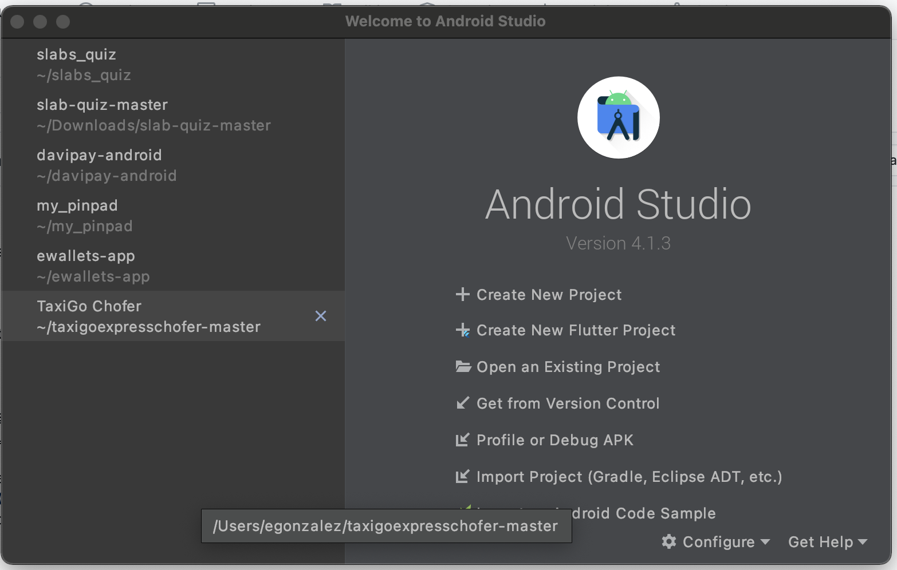
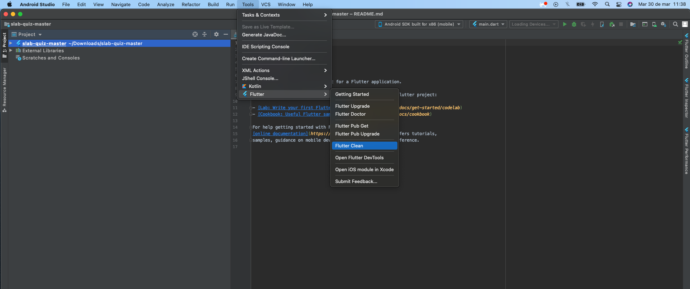
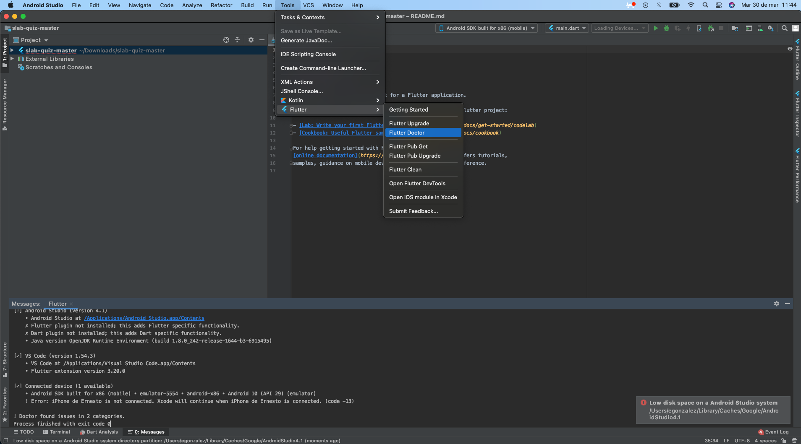
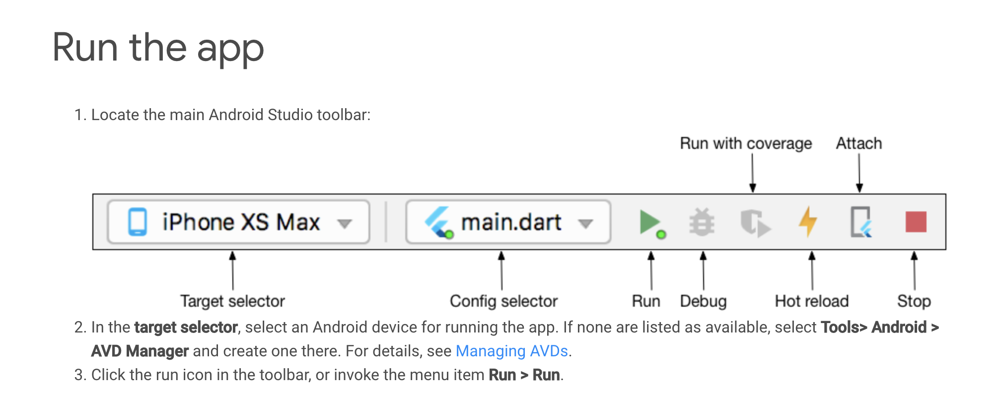

# slabs_quiz

Demo app for symmetrics lab

## Getting Started

This project is a starting point for a Flutter application.

A few resources to get you started if this is your first Flutter project:

- [Lab: Write your first Flutter app](https://flutter.dev/docs/get-started/codelab)
- [Cookbook: Useful Flutter samples](https://flutter.dev/docs/cookbook)

For help getting started with Flutter, view our
[online documentation](https://flutter.dev/docs), which offers tutorials,
samples, guidance on mobile development, and a full API reference.

## Compilation Guide

- Open the project with Android Studio

Try to clone the repository or download the code for open inside AndroidStudio
Once you have the project on your files. Pick the option 'Open an existing project'

With the project available on IDE. Follow this steps for the compilation an run on device.

